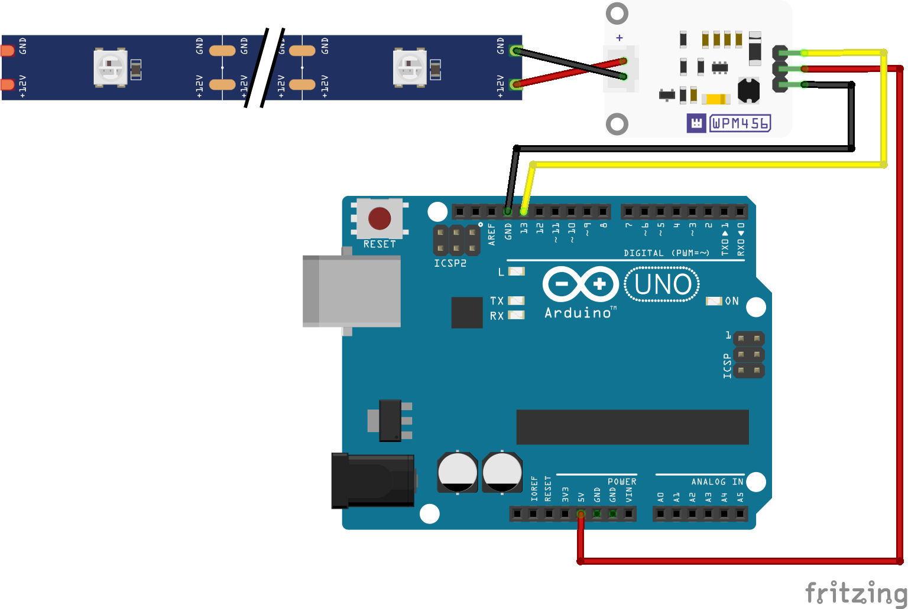

# Whadda LED driver module
This example shows how you can use the Whadda LED driver module (WPM4560) with an Arduino® compatible board to drive 12 V LED strips.

## Library dependencies
* None

## Wiring diagram

## Additional information
  For more information about the Whadda LED driver module (WPM4560), check the manual available at [whadda.com](https://whadda.com)
